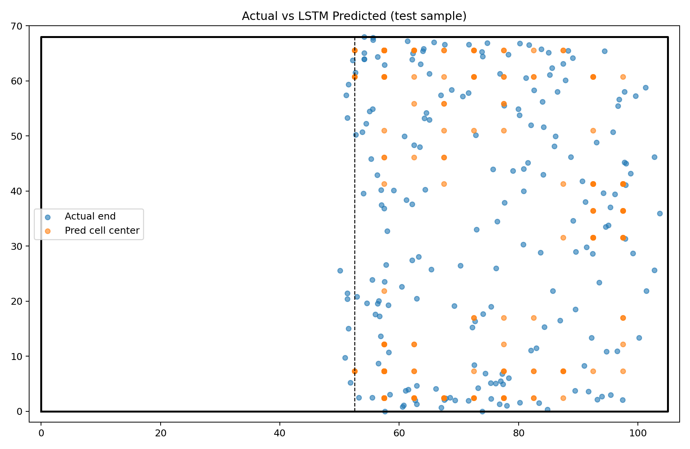
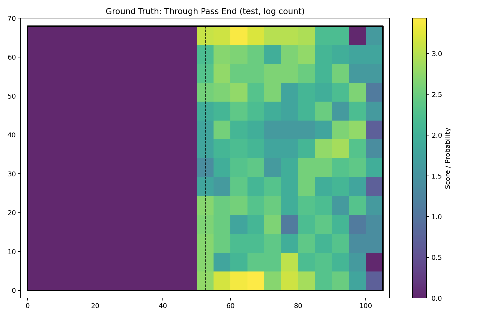
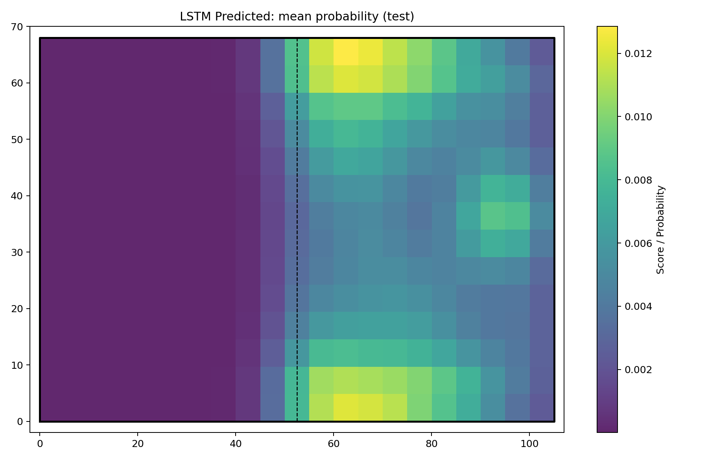

# LANCON : Pathfinder ⚽

> **K리그 · 서울시립대 공개 AI 경진대회 — Track 2 (아이디어 개발 부문)**
> **Through-Pass Destination Prediction with a Variable-Length LSTM Encoder**

축구 경기 중 발생하는 **possession 이벤트 시퀀스(가변 길이 시계열)** 를 **LSTM** 으로 인코딩하여,
**수비수 위치 정보가 전혀 없는 제약 조건** 속에서 다음에 전개될 **'공간 침투 패스(Through Pass)의 도달 위치'** 를
경기장 그리드(Grid) 단위의 **확률 분포(Heatmap)** 로 예측하는 AI 기반 전술 분석 서비스 MVP입니다.

<p align="center">
  
</p>

---

## 📌 1. 제안 배경 및 목적

### 🔎 Problem Definition
* **복합 맥락의 손실** — 기존 기록은 '누가 누구에게 패스했다'는 단편적 사실만 남겨, 선수 배치·압박 강도 등 전술 맥락 속에서 '왜 그 공간으로 패스했는가'를 설명하지 못합니다.
* **공간 가치 평가의 주관성** — 수비 라인을 깨뜨리는 '침투 패스'의 창의성과 효과성을 객관적으로 정량화할 기준이 부족합니다.
* **예측 모델의 부재** — 빌드업 시퀀스가 결국 어느 공간에서 종결될지 실시간으로 추정해 수비 대응 전략에 활용할 데이터 기반 모델이 없습니다.

### 💡 목적
**수비수 좌표가 없는 이벤트 데이터** 라는 제약 속에서도, 직전 빌드업 시퀀스의 흐름 패턴만으로
다음 침투 패스의 도착 **'공간 확률(히트맵)'** 을 합리적으로 추정할 수 있음을 검증합니다.

### 🧱 단계 구성
* **Phase 0** — possession 시계열 재설계 · 경기/시간순 분할(누수 방지) · Top-k / 거리(m) / NLL 평가 체계 구축
* **Phase 1** — LSTM 인코더 + 2D 가우시안 소프트타깃 KL 손실 학습

---

## 🛠 2. 기술 스택

| 영역 | 사용 기술 |
| :--- | :--- |
| Language | `Python 3.x` |
| Data | `pandas`, `numpy` — CSV 파싱, possession 분절, 이벤트 기반 가변 시퀀스 벡터화 |
| Model | `PyTorch` — `nn.LSTM`(+`pack_padded_sequence`), `nn.Embedding`, `nn.KLDivLoss` |
| Visualization | `matplotlib` — 경기장 라인 드로잉, 2D Heatmap / Scatter |

---

## 📂 3. 저장소 구조

```
.
├── _lstm_pipeline.py            # 전처리 → 학습 → 평가 → 시각화 전체 파이프라인 (실행 스크립트)
├── main.ipynb                  # 동일 파이프라인의 노트북 버전 (셀 단위 실행/검증)
├── data_description.xlsx       # 대회 제공 데이터 명세 (gitignore)
├── raw_data.csv                # 대회 제공 이벤트 원본 데이터 (gitignore · 대용량)
├── match_info.csv              # 경기 메타데이터 / game_date (gitignore)
├── through_actual_heatmap.png  # [출력] 실제 침투 패스 도착 분포
├── through_pred_heatmap.png    # [출력] 모델 예측 평균 확률 분포
└── through_pred_vs_actual.png  # [출력] 실제 vs 예측 산점도
```
> ⚠️ 대회 제공 원본 데이터(`raw_data.csv`, `match_info.csv`)는 재배포 제약 및 용량 문제로 저장소에 포함하지 않습니다.
> 동일 경로에 데이터를 두고 실행하면 결과 히트맵이 재생성됩니다.

---

## 📊 4. 데이터 파이프라인

### 🧩 정제 & 제약 조건 처리
* **정렬/정제** — `game_id`, `period_id`, `time_seconds`, `action_id` 기준 정렬 후 핵심 컬럼 결측 행 제거, 경기장 규격 밖 좌표 클리핑, 범주형 결측은 `UNK` 처리.
* **누적 득실차(`goal_diff`)** — `Goal` 이벤트로부터 각 시점의 누적 득실차를 계산하되, 현재 이벤트의 골은 `shift`로 제외하여 **미래 정보 누수를 방지**합니다.

### 🔗 Possession 시퀀스 분절
연속 이벤트를 하나의 빌드업 흐름으로 묶되, 아래 조건 중 하나라도 발생하면 새 possession으로 끊습니다.
* 공격 팀(`team_id`) 변경 · 전후반(`period_id`) 또는 경기(`game_id`) 변경
* 직전 이벤트와의 간격이 **15초 초과(`MAX_GAP_SEC`)** 또는 음수
* 내부 이벤트 간격 `dt`는 `[0, 15]`초로 클리핑하여 시계열 피처로 사용

### 🎯 침투 패스(Through Pass) 프록시 정의
수비수 좌표가 없는 제약에서 라인 브레이킹 패스를 재현하기 위해, 아래 전진성·위험성 필터를 만족하는 **성공 패스만** 예측 타깃으로 사용합니다. *(105m × 68m 표준 경기장 기준)*

| 조건 | 기준 |
| :--- | :--- |
| 타입 / 성공 | `type_name == 'Pass'` & `result_name == 'Successful'` |
| 최소 전진 거리 | `end_x - start_x >= 12` (m) |
| 공격 지역 진입 | `end_x >= 50` (m) |
| 유효 범위 | `x ∈ [0, 105]`, `y ∈ [0, 68]` |

### ⚙️ 피처 엔지니어링 & 학습 데이터 설계

**1) Input — 가변 길이 시퀀스 (Context)**
각 침투 패스 직전, 같은 possession 내부의 최근 이벤트(최대 `MAX_SEQ_LEN=20`, 최소 `MIN_SEQ_LEN=2`)를 역추적해 가변 시퀀스를 구성합니다. `pad_sequence` + `pack_padded_sequence`로 배치 처리합니다.

| # | 연속 피처 (9D, `N_CONT=9`) | 정규화 |
| :---: | :--- | :--- |
| 1–4 | `start_x` `start_y` `end_x` `end_y` | `/105`, `/68` |
| 5 | `prog_x` | `max(end_x - start_x, 0) / 105` |
| 6 | `total_dist` | 패스 이동거리 / 경기장 대각선 |
| 7 | `dt` | `/15` (직전 이벤트 간격) |
| 8 | `goal_diff` | `clip(-3,3) / 3` |
| 9 | `time_seconds` | `clip(0,3000) / 3000` |

* 범주형 임베딩 — `main_position` → `nn.Embedding(8)`, `type_name` → `nn.Embedding(8)`
* **LSTM 입력 차원** — `N_CONT(9) + EMB_POS(8) + EMB_TYPE(8) = 25` / 타임스텝

**2) Output — 그리드 확률 분포**
* 경기장을 **`21 × 14 = 294` 그리드 셀** 로 분할, 도착 좌표가 속한 셀을 타깃 클래스로 사용.
* **소프트 타깃** — 타깃 셀 중심 기준 **표준편차 5m(`SOFT_SIGMA`) 2D 가우시안** 분포를 정답으로 사용해 인접 공간까지 부드럽게 학습(`KLDivLoss`).

**3) 모델 구조**
```
[연속 9D]   ─┐
[pos emb 8D] ├─▶ concat(25D) ─▶ LSTM(hidden=128) ─▶ MLP head ─▶ 294 logits
[typ emb 8D] ─┘                                   (Linear→ReLU→Dropout0.2→Linear)
```
* **학습 설정** — `BATCH=256`, `EPOCHS=12`, `Adam(lr=1e-3)`, 검증 NLL 최저 지점 가중치를 best model로 저장.

### 🧪 데이터 분할 (누수 방지)
`match_info.csv`의 `game_date` 기준 **경기 단위 + 시간순 정렬** 후 분할합니다.
**Train / Val / Test = 70% / 15% / 15%** — 같은 경기의 이벤트가 train·test에 동시에 들어가지 않습니다.

### 📐 평가 지표
* **Top-1 / Top-3 / Top-5** — 상위 k개 셀 안에 정답 셀이 포함되는 비율
* **거리 오차(`dist_m`)** — 최고확률 셀 중심과 실제 도착 좌표 간 평균 거리(m)
* **NLL** — 정답 셀에 대한 음의 로그우도 (best model 선택 기준)
* **베이스라인** — 학습셋 최빈 셀(majority cell) 대비 Top-1 정확도 비교

---

## 📈 5. 결과 시각화

소스 실행 후 아래 3종의 핵심 산출물이 자동 생성됩니다.

| 실제 도착 분포 (Ground Truth) | 모델 예측 분포 (AI Predicted) |
| :---: | :---: |
|  |  |

* **`through_actual_heatmap.png`** — 테스트셋 실제 침투 패스 도착 분포(`log1p` 스케일). 하프라인 너머, 특히 **중앙·하프스페이스·페널티 박스 진입 구간**에 밀도가 집중됩니다.
* **`through_pred_heatmap.png`** — 모델이 예측한 셀별 확률 평균. 수비수 데이터가 전무함에도 **직전 시퀀스 흐름만으로 실제와 유사한 공간 집중 패턴**을 유도합니다.
* **`through_pred_vs_actual.png`** — 테스트 샘플 200개의 실제 도착점(Blue)과 예측 최고확률 셀 중심(Orange)을 경기장 위에 동시 산점도로 표시. 예측 지형이 실제 공격 구역 내에 안정적으로 군집함을 확인합니다.

---

## ▶️ 6. 실행 방법

```bash
# 1) 의존성 설치
pip install numpy pandas matplotlib torch

# 2) raw_data.csv, match_info.csv 를 같은 경로에 둔 뒤 실행
python _lstm_pipeline.py
```
또는 `main.ipynb`를 위에서 아래로 순차 실행하면 동일하게 학습 + 히트맵 3종이 생성됩니다.
* GPU(CUDA)가 있으면 자동 사용, 없으면 CPU로 동작합니다.
* 빠른 검증이 필요하면 설정부의 `MAX_GAMES`를 정수로 지정해 일부 경기만 사용할 수 있습니다.

---

## 🚀 7. 실용성 및 향후 확장

* **정량적 스카우팅** — AI 예측 분포보다 훨씬 낮은 확률의 좁은 공간으로 패스를 찔러 성공시킨 선수를 추적하여 **'AI조차 예측하지 못한 창의적 패서'** 를 정량 발굴(샘플별 `player` 정보 보존 → 선수 단위 분석 확장 가능).
* **아키텍처 확장** — LSTM 인코더에서 **Transformer(Self-Attention)** 또는 **Seq2Seq** 로 업그레이드해 더 긴 의존성과 복합 빌드업 패턴 학습.
* **실시간 미디어/방송 솔루션** — 라이브 이벤트 피드와 연동해 중계 화면에 다음 침투 공간 예측 히트맵과 취약 공간 가이드를 실시간 제공.
